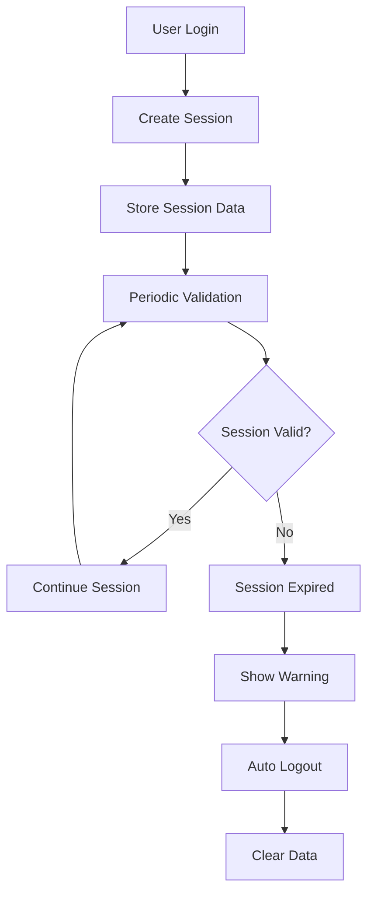

# Session Management System - HostelHub

## Overview

The HostelHub application implements a comprehensive session management system that ensures secure, persistent, and user-friendly authentication experiences across browser sessions and page refreshes.

## Features

### 🔐 **Authentication Persistence**
- **Session Storage**: User sessions persist across browser tabs and page refreshes
- **Automatic Refresh**: Sessions are automatically refreshed to prevent expiry
- **Graceful Degradation**: Handles network issues and session failures gracefully

### 🛡️ **Security Features**
- **Session Validation**: Regular checks for session validity
- **Automatic Logout**: Users are automatically logged out when sessions expire
- **Secure Storage**: Sensitive data is properly encrypted and stored

### 🎯 **User Experience**
- **Seamless Navigation**: Users stay logged in across page refreshes
- **Session Status Indicators**: Visual feedback on session status
- **Automatic Redirects**: Users are redirected to their intended destination after login

## Architecture

### Core Components

#### 1. **AuthContext** (`src/lib/auth-context.tsx`)
- Global authentication state management
- Session lifecycle management
- Automatic session refresh
- Error handling and recovery

#### 2. **SessionManager** (`src/components/auth/SessionManager.tsx`)
- Session expiry notifications
- Manual session refresh options
- User-friendly error messages

#### 3. **SessionStatus** (`src/components/auth/SessionStatus.tsx`)
- Real-time session status display
- Session time remaining indicator
- Manual refresh functionality

#### 4. **Session Utilities** (`src/lib/session-utils.ts`)
- Local storage management
- Session data persistence
- User preferences storage
- Redirect path management

### Session Flow



## Implementation Details

### Session Data Structure

```typescript
interface SessionData {
  userId: string;
  email: string;
  role: string;
  lastActivity: number;
  preferences?: Record<string, any>;
}
```

### Session Lifecycle

1. **Initialization**
   - Check for existing session on app load
   - Validate session with Appwrite
   - Load user data from database

2. **Active Session**
   - Periodic session validation (every 5 minutes)
   - Automatic session refresh
   - Activity tracking

3. **Session Expiry**
   - Warning notifications
   - Automatic logout
   - Data cleanup

### Security Measures

- **Session Timeout**: 24-hour session expiry
- **Activity Tracking**: Session activity is monitored
- **Secure Storage**: Sensitive data is properly handled
- **Automatic Cleanup**: Expired sessions are automatically cleared

## Usage

### Basic Authentication

```typescript
import { useAuth } from '@/lib/auth-context';

function MyComponent() {
  const { user, isAuthenticated, signOut } = useAuth();
  
  if (!isAuthenticated) {
    return <div>Please log in</div>;
  }
  
  return (
    <div>
      <p>Welcome, {user?.email}</p>
      <button onClick={signOut}>Sign Out</button>
    </div>
  );
}
```

### Session Management

```typescript
import { useAuth } from '@/lib/auth-context';

function Dashboard() {
  const { 
    user, 
    isAuthenticated, 
    sessionExpired, 
    refreshSession 
  } = useAuth();
  
  // Handle session expiry
  if (sessionExpired) {
    return <SessionExpiredWarning onRefresh={refreshSession} />;
  }
  
  return <DashboardContent user={user} />;
}
```

### Session Utilities

```typescript
import { 
  saveSession, 
  getSession, 
  clearSession,
  savePreferences,
  getPreferences 
} from '@/lib/session-utils';

// Save session data
saveSession({
  userId: 'user123',
  email: 'user@example.com',
  role: 'HostelLister',
  lastActivity: Date.now()
});

// Get session data
const session = getSession();

// Save user preferences
savePreferences({
  theme: 'dark',
  language: 'en',
  notifications: true
});
```

## Configuration

### Environment Variables

```env
# Appwrite Configuration
NEXT_PUBLIC_APPWRITE_ENDPOINT=your_appwrite_endpoint
NEXT_PUBLIC_APPWRITE_PROJECT_ID=your_project_id
NEXT_PUBLIC_APPWRITE_DATABASE_ID=your_database_id
NEXT_PUBLIC_COLLECTION_USERS=your_collection_id
NEXT_PUBLIC_GOOGLE_CLIENT_ID=your_google_client_id
```

### Session Settings

```typescript
// Session management constants
const SESSION_CHECK_INTERVAL = 5 * 60 * 1000; // 5 minutes
const SESSION_TIMEOUT_WARNING = 10 * 60 * 1000; // 10 minutes
const SESSION_EXPIRY = 24 * 60 * 60 * 1000; // 24 hours
```

## Error Handling

### Common Scenarios

1. **Network Issues**
   - Retry logic with exponential backoff
   - Graceful degradation
   - User-friendly error messages

2. **Session Expiry**
   - Automatic detection
   - User notification
   - Seamless logout

3. **Invalid Sessions**
   - Automatic cleanup
   - Redirect to login
   - Data preservation

### Error Recovery

```typescript
// Automatic retry with exponential backoff
const checkAuthStatus = async (retryCount = 0) => {
  try {
    // Authentication check logic
  } catch (error) {
    if (retryCount < 3) {
      setTimeout(() => {
        checkAuthStatus(retryCount + 1);
      }, 1000 * Math.pow(2, retryCount));
    }
  }
};
```

## Best Practices

### Security
- Never store sensitive data in localStorage
- Always validate sessions server-side
- Implement proper session expiry
- Use secure session tokens

### Performance
- Minimize session checks
- Use efficient storage methods
- Implement proper cleanup
- Optimize for mobile devices

### User Experience
- Provide clear feedback
- Handle edge cases gracefully
- Maintain session state
- Implement smooth transitions

## Troubleshooting

### Common Issues

1. **Session Not Persisting**
   - Check localStorage permissions
   - Verify session data structure
   - Ensure proper cleanup

2. **Automatic Logout**
   - Check session expiry settings
   - Verify network connectivity
   - Review error logs

3. **Session Refresh Issues**
   - Check Appwrite configuration
   - Verify API endpoints
   - Review authentication flow

### Debug Tools

```typescript
// Enable debug logging
console.log('Session data:', getSession());
console.log('User preferences:', getPreferences());
console.log('Session age:', getSessionAge());
```

## Future Enhancements

- **Multi-device Sessions**: Support for multiple active sessions
- **Session Analytics**: Track session usage patterns
- **Advanced Security**: Biometric authentication support
- **Offline Support**: Offline session management
- **Session Sharing**: Secure session sharing between devices 